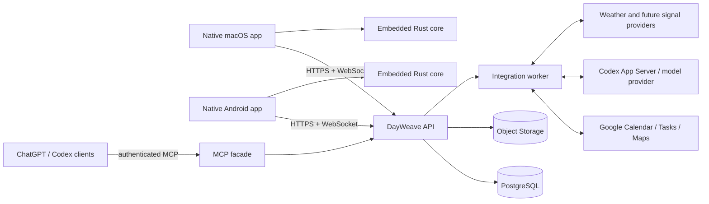
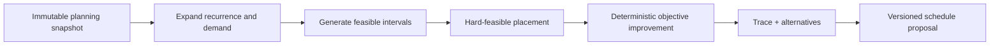

# DayWeave architecture

Status: accepted implementation baseline  
Requirements: [product-requirements.md](product-requirements.md)  
Decision ledger: [discovery-answers.md](discovery-answers.md)

## 1. Architecture goals

The architecture is optimized for five constraints:

1. planning and execution remain useful offline;
2. macOS and Android make the same scheduling decisions without duplicating the scheduler;
3. Google and AI outages cannot corrupt canonical personal data;
4. all external mutations cross explicit safety boundaries; and
5. the private production service fits within the USD 50/month Nebius budget.

## 2. System context



The Rust core owns domain invariants, recurrence expansion, deterministic scheduling, schedule explanations, and portable validation. Each native client owns platform UI, local persistence, OS integration, and a thin generated binding to that core. The backend owns cross-device canonical state, provider integrations, assistant orchestration, MCP proposals, attachment storage, and audit history.

## 3. Monorepo layout

```text
dayweave/
├── apps/
│   ├── macos/                    # SwiftUI app, helper, widgets, extensions
│   └── android/                  # Kotlin/Compose app, widgets, services
├── crates/
│   ├── dayweave-core/            # portable domain + scheduler
│   ├── dayweave-ffi/             # UniFFI/C ABI boundary and generated schemas
│   └── dayweave-contracts/       # API/sync/provider wire contracts
├── server/
│   ├── dayweave-api/             # HTTP, WebSocket, auth, sync, MCP facade
│   └── dayweave-worker/          # Google, AI, notifications, maintenance
├── integrations/dayweave/        # private Codex plugin, skill, MCP registration
├── deploy/                        # containers, migrations, Nebius, backup, runbooks
├── docs/                          # product, ADRs, setup, security, operations, user docs
├── scripts/                       # reproducible build, bindgen, package, verification
└── .github/workflows/             # checks, artifacts, channels, deployment
```

Folders may be introduced incrementally, but ownership boundaries in this map are stable.

## 4. Core domain architecture

### 4.1 Identity and revision model

- Entity IDs and operation IDs use time-sortable UUIDv7 values.
- Every mutable entity has `revision`, `created_at`, `updated_at`, optional `deleted_at`, owner/workspace ID, source provenance, and privacy classification.
- Instants are stored in UTC. User intent also retains the IANA zone and whether the value is absolute or floating.
- Calendar recurrences use an RFC 5545-compatible representation plus explicit exception instances.
- Duration uses integer seconds internally. Display and capture may use natural units.
- Unknown, exact, and ranged values are distinct tagged values; unknown is never encoded as zero.

### 4.2 Aggregate boundaries

- **Work graph:** goal, project, task hierarchy, measures, links, and typed dependencies.
- **Routine:** recurrence definition plus ordered step templates and generated occurrences.
- **Habit:** recurrence/frequency policy plus occurrence records and analytics projections.
- **Calendar event:** provider-neutral event plus provider mappings and series exceptions.
- **Schedule:** plan revision, horizon, blocks, constraint snapshot, score, and explanation trace.
- **Execution session:** single active lease, timer segments, pauses, actual duration, and correction history.
- **Proposal:** immutable external/AI draft plus review state and resulting change set.

Cross-aggregate mutations run as explicit commands and produce domain events/audit records. Core command handlers enforce cycle prevention, only-leaf scheduling, single-active-item, hard dependency behavior, and privacy propagation.

### 4.3 Hierarchy projection

Only leaf tasks contribute scheduling demand. Parent progress is a projection over descendant demand and any explicitly modeled independent component. This prevents a parent estimate from double-counting its children. Auto-completion is a command triggered by the projection and can be overridden with an auditable manual state.

## 5. Scheduler architecture

### 5.1 Pipeline



1. **Snapshot:** atomically capture items, availability, fixed events, preferences, horizons, and the previous plan.
2. **Expand:** generate occurrences and leaf-task demand, including session limits, setup cost, buffers, and dependency bounds.
3. **Candidates:** produce discrete candidate intervals at the active planning granularity; reject hard-infeasible candidates early.
4. **Place:** satisfy immutable events and hard constraints using deterministic interval allocation and bounded branch-and-bound/min-cost search.
5. **Improve:** optimize a lexicographically ordered score with fixed tie-breaking. Movement cost protects schedule stability.
6. **Explain:** retain rejected-candidate reasons, binding constraints, score contributions, slack, and the minimal facts needed for “Why here?”.
7. **Publish:** return a versioned proposal. Applying it is a separate, auditable operation.

The initial implementation is domain-specific Rust rather than a networked solver. Solver adapters may later use an optimized native library only if they preserve deterministic fixtures on both client platforms.

### 5.2 Constraint representation

Every constraint implements a common evaluation shape:

- scope: item, item kind, project, profile, or global;
- strength: hard or soft;
- condition: temporal, resource, context, dependency, quota, or custom;
- violation details: stable code, affected entities, measured amount, and remedy hints;
- soft cost: objective family, weight, and normalized penalty.

Hard constraints filter candidates or invalidate a plan. Soft constraints contribute to an objective family. The default objective families follow the precedence in `SCH-003`; user configuration changes weights/order but not invariant safety checks.

### 5.3 Time resolution and scale

- The canonical engine works in seconds but generates candidates at a configurable quantum, fifteen minutes by default and five minutes at high detail.
- Fixed event boundaries are preserved exactly even when they are off-quantum.
- Candidate density is reduced outside the firm horizon and around stable previous placements.
- A ninety-day solve is incremental: preserve still-valid prior placements, solve changed connected components, then run bounded global improvement.
- Every solve is cancellable and reports phases/progress when longer than one second.

### 5.4 Determinism

Determinism requires sorted stable inputs, a recorded engine/config version, fixed integer scoring, a recorded seed for any randomized test-only path, and stable tie-breaks by candidate time then entity ID. Floating-point values are not used for plan ranking. A serialized planning snapshot is a reproducible test artifact.

### 5.5 Manual overrides and publication

The engine never invents a hard violation. A manual placement that violates a rule is stored with the exact acknowledged violations and treated as pinned demand in later solves. Firm and tentative blocks belong to the same schedule revision; a publication projector emits only firm blocks to Google and transitions tentative blocks when the rolling boundary advances.

## 6. Client architecture

### 6.1 Shared layers

Both clients follow the same conceptual layers:

1. native presentation and platform integrations;
2. application commands/queries and view-state reducers;
3. encrypted SQLite local store, durable operation outbox, and sync inbox;
4. generated Rust-core bindings for validation, recurrence, scheduling, and explanations; and
5. HTTP/WebSocket API client plus attachment transfer manager.

The binding surface exchanges versioned, serialization-friendly value objects. Swift and Kotlin do not hold Rust references across UI frames. Panics and errors become typed native errors; unsafe Rust is forbidden in the workspace unless a separately reviewed FFI shim makes the minimum unavoidable exception.

### 6.2 macOS

The macOS client is a SwiftUI app using platform frameworks for App Intents/Shortcuts, Spotlight indexing, WidgetKit, notifications, menu bar, share extension, file access, biometrics/keychain, Focus integration where public APIs allow it, and an optional launch-at-login helper. A three-column adaptive shell hosts navigation, timeline/content, and inspector/assistant.

Local development uses Swift Package Manager where possible. Release packaging produces a locally signed `.app` and private update-feed artifact. Notarization remains an optional later distribution step.

### 6.3 Android

The Android client uses Kotlin, Jetpack Compose, Room/SQLCipher-compatible storage, WorkManager, foreground service for the active timer, Health Connect, App Actions/shortcuts, notifications, widgets, share target, Quick Settings tile, BiometricPrompt, and Android Keystore.

Release packaging produces an arm64-capable signed APK. The stable signing key is supplied outside the repository. ADB detects the actual Pixel 11 OS/API level and runs the final device suite.

### 6.4 Local data protection

Each client generates a device database key and protects it with Keychain/Secure Enclave policy or Android Keystore. Refresh tokens and provider secrets never enter ordinary preferences. Sensitive-item search indexes are either encrypted with the database or omitted from OS-level indexes. Widget and Spotlight projections contain redacted records when locked.

## 7. Backend architecture

### 7.1 API service

The Rust API service provides:

- session and device authentication;
- REST-style command/query endpoints described by a versioned OpenAPI contract;
- a WebSocket change stream with cursor-based catch-up;
- idempotency-key enforcement;
- attachment preflight and signed transfer URLs;
- proposal review/apply endpoints;
- MCP authentication and read/proposal facade; and
- health, readiness, and content-free operational telemetry.

Commands validate authorization and expected revision, write canonical rows and an append-only operation/audit record in one PostgreSQL transaction, and enqueue external effects through a transactional outbox.

Canonical planner items are exposed under `/v1/items`. Clients generate item UUIDs offline and send an `Idempotency-Key` for every create, replace, delete, and restore command. Replacements carry an expected revision and replace the full mutable item contract. The repository commits the item or tombstone, hierarchy edge, idempotency result, audit operation, outbox message, and delta-stream record atomically. Parent changes are serialized per workspace and reject cycles; only leaves may enter executable states, while `sibling_order` gives every level deterministic ordering.

`GET /v1/items/delta` returns ordered upserts and tombstones behind an opaque, versioned, integrity-checked cursor bound to the authenticated deployment workspace. Hierarchy edits also revision and emit affected parent snapshots so derived leaf executability converges without same-revision replacement. Clients persist the returned cursor only in the same local transaction that applies the page. No item command directly invokes Google or another provider; workers consume the transactional outbox separately.

### 7.2 Worker

The worker leases transactional-outbox jobs and owns:

- Google incremental sync and webhook/channel renewal;
- firm-block publication and external deletion/move reconciliation;
- Google Tasks synchronization;
- Codex App Server/model orchestration;
- push/email notification fan-out;
- URL preview, OCR, and attachment processing;
- scheduled recomposition and tentative-to-firm promotion;
- backup verification, retention, and operational alerts; and
- weather/context refresh.

Every job is idempotent, has bounded exponential retry, a dead-letter state, correlation ID, and an operator-visible failure reason. Side effects record provider request and remote resource IDs before acknowledgement.

### 7.3 PostgreSQL

PostgreSQL holds canonical normalized entities, schedule revisions, sync cursors, provider mappings, sessions, audit/operations, proposals, and the outbox. Key tables use workspace/user partition keys even in the personal deployment. Row access always includes that scope.

Large attachment bytes and backup archives live in object storage. PostgreSQL stores hashes, metadata, encryption envelope, scan/extraction state, and object version IDs. Provider refresh credentials and sensitive field envelopes are encrypted with an application key not stored in database backups.

### 7.4 Sync protocol

The sync model combines canonical current state with an append-only ordered operation stream:

- The client creates an operation ID and writes the local mutation plus outbox entry atomically.
- The server deduplicates the operation ID, checks base revision, applies or returns a structured conflict, and assigns a monotonic workspace cursor.
- The WebSocket announces new cursors; clients fetch ordered deltas and persist the cursor with the applied inbox transaction.
- Entity tombstones make deletion converge. Thirty-day trash is a product state; tombstone retention may be longer for sync safety.
- Commutative field changes merge automatically. Concurrent changes to the same semantic field or structure return both values for review.
- Single-active-item uses a short server lease/version. An offline start is accepted locally; reconnect resolves a conflict without losing either time segment.

The server does not use silent last-write-wins for user-authored content.

## 8. Google integration architecture

### 8.1 Provider-neutral boundary

Google APIs are behind Calendar, Tasks, Maps, and OAuth interfaces with contract fakes. Core entities never depend on Google wire types. Mapping records relate provider account, remote calendar/list, remote resource ID, recurrence instance, ETag/version, and local entity/block.

### 8.2 Calendar loop prevention

Published events include private DayWeave identity metadata where Google permits it. The worker records outbound revision/ETag and recognizes its echoed webhook. A remote change with a new ETag becomes an inbound command; it does not immediately echo another write unless canonical output differs.

Move and delete semantics are explicit commands:

- move a DayWeave block remotely → update placement, record the external source, pin;
- delete the remote block → unschedule it and keep the task;
- edit an imported event → update the fixed event and recompose;
- edit attendees/time on an attendee event → stop for review if the effect is not already an approved user action.

### 8.3 Offline and conflicts

Google mutations use the server outbox and conditional versions. A version conflict fetches remote state, classifies field differences, and either merges independent fields or creates a conflict review. The client displays pending/failed/conflicted state. Provider outage never discards canonical work.

## 9. Assistant architecture

### 9.1 Boundary

The `AssistantProvider` boundary supports a macOS-local Codex App Server process
as the primary provider and a separately authenticated remote API provider for
Android or explicit fallback use. The contained macOS host uses managed
device-code login through Codex itself; it exposes no inbound browser callback.
DayWeave never extracts, copies, or syncs the resulting ChatGPT credentials.
Clients never scrape ChatGPT sessions or embed browser cookies.

Production App Server startup is currently disabled. Enabling it requires an
adapter that pins the exact CLI version, verifies that build's generated JSON
Schema, and launches a private verified copy. The outer profile allows outbound
Codex service traffic but no process fork, network bind, or inbound connection;
turn tools cannot spawn commands or reach files outside the isolated home.
Protocol traffic is bounded and privileged server requests fail closed. A CLI
build that cannot prove the complete contract is incompatible, even when
ordinary login and chat methods work.

Assistant requests consist of an explicit, redacted context package, user request, allowed tool schema, model/reasoning preference, and confirmation policy. Tool calls target application commands or simulations—not database tables.

### 9.2 Read, propose, apply

All assistant behavior follows three stages:

1. **Read:** retrieve only permitted fields and produce a context manifest visible in the chat.
2. **Propose:** return structured commands, a summary, rationale, confidence/unknowns, and external effects.
3. **Apply:** policy either executes a harmless single-item command with undo or requires preview/approval.

Schedule explanations use solver trace facts. The model may rewrite those facts in plain language but cannot add unverified reasons.

The implemented typed, grouped review and exact-undo contract is documented in
[proposal-applications.md](proposal-applications.md).

### 9.3 Memory and proactive work

Assistant memory is a separate user-editable store with explicit provenance and delete/disable controls. Proactive jobs first run deterministic eligibility checks for quiet hours, category, sensitivity, urgency, and daily cap; only then may they invoke a model. Sensitive items do not enter proactive context unless the user opted in.

### 9.4 Offline behavior

Local natural-language parsing may handle a conservative subset. Other model requests become visibly queued drafts or return an actionable offline state. No assistant request is required to open the app, view the schedule, start/stop work, capture a structured item, or recompose locally.

## 10. MCP and plugin architecture

The private plugin under `integrations/dayweave` packages a scheduling skill and MCP registration. The MCP facade exposes two capability families:

- permission-filtered read resources/queries such as availability, selected schedule detail, and proposal status;
- side-effect-free simulation plus `submit_proposal` tools.

There is deliberately no direct canonical mutation tool for external assistants. `submit_proposal` validates schema and permissions, stores provenance and expiry, and returns an Inbox reference. Accepting a proposal in DayWeave translates it into ordinary commands and confirmation policy. Each MCP client has a separate revocable credential and field-level access policy.

MCP submissions themselves remain non-executable; the device-only translation
and application boundary is described in
[proposal-applications.md](proposal-applications.md).

## 11. Security architecture

### 11.1 Trust zones

- **Device zone:** decrypted local data exists only after app unlock; OS key stores protect database/session keys.
- **Ingress zone:** HTTPS tunnel/reverse proxy terminates public traffic, enforces basic request limits, and forwards only to the API network.
- **Application zone:** API and worker have scoped database/object/provider access; no public database port exists.
- **Data zone:** PostgreSQL and object storage are encrypted and backed up; sensitive field keys are separated.
- **External zone:** Google, Codex/model, Maps, weather, email/push, and MCP clients receive only purpose-specific data.

### 11.2 Sensitive-item propagation

Sensitivity is enforced as policy, not only a UI flag. Query projectors, notification templates, widgets, Spotlight/indexing, assistant context builders, MCP serializers, attachment processors, exports, and logs must each require an explicit disclosure mode. Tests use seeded sensitive canaries and assert they do not appear in forbidden outputs.

### 11.3 External-effect guard

Commands classify effects as local reversible, local destructive, schedule-wide, or external. The application layer enforces:

- local reversible single-item: may apply with undo;
- bulk or schedule-wide: preview;
- destructive, deadline relaxation, or hard-constraint relaxation: explicit confirmation;
- Google attendee/event side effect: preview and explicit confirmation;
- MCP/external assistant: proposal only.

No UI or AI entry point may bypass this shared command policy.

## 12. Production topology and cost boundary

The initial Nebius deployment uses one regular `cpu-e2` VM (2 vCPU, 8 GiB RAM) in `eu-north1`, beginning with roughly 32 GiB of SSD and Standard Object Storage. Containers run API/MCP, worker, PostgreSQL, and reverse proxy/Nebius Tunnel. Resource limits keep integration/OCR/AI jobs from starving PostgreSQL.

Encrypted incremental database backups run at least every fifteen minutes and daily snapshots/archives are copied to versioned object storage for seven days. Attachment objects use object versioning/retention consistent with the same policy. A restore verification job uses a temporary isolated database and validates schema, counts, checksums, and a scheduler smoke test.

A locally authenticated human profile may bootstrap the project, deployment identity, runtime identity, storage policy, and CI federation/credentials. Routine automation uses least-privilege service identities. No CLI profile or long-lived credential is copied into the repository.

The deployment must produce a monthly cost estimate before creation and alert before the USD 50 including-tax ceiling. Vertical or horizontal scaling is an explicit later decision backed by measured resource pressure.

## 13. Build, CI, and release architecture

CI is split into fast pull/commit checks and release pipelines:

- Rust format, lint, unit/property tests, API/schema compatibility;
- Swift build/test and macOS UI tests on a macOS runner;
- Kotlin/Gradle lint, test, Compose/UI emulator tests;
- provider contract suites against fakes and isolated test resources;
- container build, dependency/image/secret scans, migration rehearsal;
- deterministic scheduler fixture comparison across Rust host and client bindings;
- signed channel artifacts with checksums and provenance; and
- deployment plus smoke/backup checks for authorized stable releases.

Development, beta, and stable channels have distinct update metadata. macOS receives a private update-feed artifact; Android receives a securely signed APK and update manifest. Store submission is not assumed.

## 14. Observability and operations

Logs are structured around correlation, operation, job, and provider-resource IDs and explicitly exclude titles, notes, attachment text, transcripts, OAuth tokens, assistant prompts, and schedule content. Metrics cover request/job latency, sync lag, queue depth, solver phase duration, database health, backup age, object errors, provider quotas, and cost signals.

Email and in-app alerts cover service failure, stale or failed backup, restore verification, budget threshold, suspicious authentication, certificate/tunnel failure, dead-letter growth, and provider authorization expiry. Runbooks define diagnosis, rollback, credential revocation, and recovery.

## 15. Architecture decision records

### ADR-001 — native clients with a shared Rust core

**Decision:** SwiftUI on macOS and Jetpack Compose on Android; share domain/scheduler code through Rust bindings.  
**Reason:** native platform quality is required, while scheduling invariants must not diverge. Rust is already the backend/core toolchain and can produce portable deterministic libraries.  
**Consequences:** maintain a small versioned FFI surface and cross-language fixture suite; platform UI remains independently implemented.

### ADR-002 — deterministic offline scheduler; AI outside the solving boundary

**Decision:** the Rust core computes plans and evidence without network/model calls.  
**Reason:** offline use, reproducibility, safety, speed, and grounded explanations.  
**Consequences:** natural-language interpretation produces structured draft constraints; assistant prose cannot override solver truth.

### ADR-003 — backend canonical state with durable local-first clients

**Decision:** clients optimistically write encrypted local state and an outbox; PostgreSQL is the cross-device canonical source, using revisions and an operation stream.  
**Reason:** full offline work and near-real-time convergence are both required.  
**Consequences:** conflicts are explicit, operations idempotent, tombstones retained, and client migrations are first-class.

### ADR-004 — transactional outbox for every external effect

**Decision:** Google, push/email, AI jobs, and object-processing work begin from an outbox record committed with canonical state.  
**Reason:** a crash between database commit and provider call must not lose or duplicate work.  
**Consequences:** workers need idempotency, retries, dead-letter operations, and provider mapping tables.

### ADR-005 — PostgreSQL and services on one right-sized Nebius VM initially

**Decision:** self-host PostgreSQL with API, worker, and ingress on one 2-vCPU/8-GiB VM; object storage holds blobs/backups.  
**Reason:** managed database pricing exceeds the personal USD 50 total budget.  
**Consequences:** automated backup/restore testing, resource isolation, patching, and monitoring are mandatory; measured growth may trigger a later split.

### ADR-006 — proposals are the external assistant mutation boundary

**Decision:** MCP clients can read granted data, simulate, and submit Inbox proposals, but cannot directly mutate canonical state.  
**Reason:** external chats have broad, difficult-to-predict context and must not create silent calendar effects.  
**Consequences:** proposals require provenance, expiry, review UI, and translation into normal commands on acceptance.

### ADR-007 — dedicated Google project and dedicated app calendar

**Decision:** use a new Google Cloud project and offer a dedicated DayWeave calendar, while importing selected external calendars and Task lists through provider-neutral mappings.  
**Reason:** isolates permissions, quotas, test resources, and ownership; makes generated blocks recognizable and reversible.  
**Consequences:** OAuth consent is a user-assisted deployment gate; integration tests use dedicated resources before real data.

### ADR-008 — application-level encryption for sensitive fields, not full user-held-key E2E

**Decision:** TLS, encrypted storage/backups, local database encryption, and envelope encryption for sensitive server fields.  
**Reason:** authorized server scheduling, search, sync, AI, and Google integration need controlled plaintext access; true E2E is incompatible with those initial requirements.  
**Consequences:** key separation, strict service authorization, sensitive-context policy, audit, and content-free telemetry are essential.

### ADR-009 — direct private distribution first

**Decision:** locally signed macOS app and privately signed direct-install Android APK, with private update metadata.  
**Reason:** no Apple Developer Program or Play Console accounts are available, and personal deployment does not require stores.  
**Consequences:** macOS Gatekeeper instructions and Android sideload/update verification must be documented; stable signing keys still need secure custody.

### ADR-010 — explicit service adapters for change-prone providers

**Decision:** Google, Codex/App Server, Maps, Health Connect, weather, notification delivery, OCR, and future WHOOP are interfaces with contract fakes.  
**Reason:** provider APIs, versions, quotas, and availability change independently of the core.  
**Consequences:** wire types stop at adapters, CI runs contract fixtures, and unavailable providers degrade without blocking core use.

## 16. Known gates and planned evolution

These are gates, not unresolved product questions:

- Full Xcode installation is needed for final macOS extensions, entitlements, UI tests, and packaging; current code can be developed with available Swift tooling where possible.
- Android SDK/ADB and the physical Pixel 11 are needed for API-level detection and final device verification.
- The owner must complete Google OAuth consent and Codex/ChatGPT device-code login when integration reaches that point.
- Stable macOS/Android signing material must be generated and stored outside Git before stable artifacts.
- WHOOP enters through the existing signal-provider boundary after the core completion gate.

No gate changes the requirement to build and verify all independent work first with fakes, synthetic fixtures, and isolated test resources.
